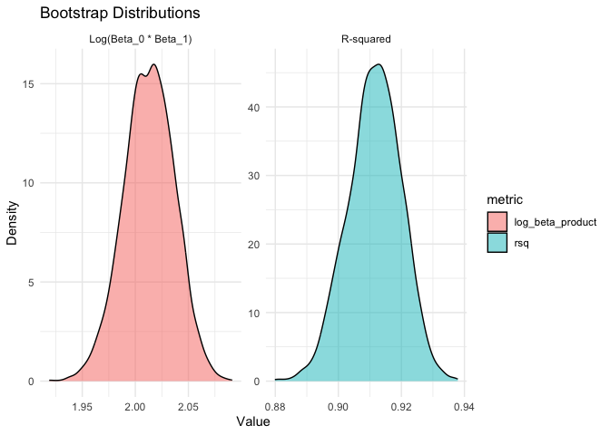

P8105 Homework 6
================
Vaiju Raja (vr2576)
2024-12-02

``` r
library(tidyverse)
```

    ## ── Attaching core tidyverse packages ──────────────────────── tidyverse 2.0.0 ──
    ## ✔ dplyr     1.1.4     ✔ readr     2.1.5
    ## ✔ forcats   1.0.0     ✔ stringr   1.5.1
    ## ✔ ggplot2   3.5.1     ✔ tibble    3.2.1
    ## ✔ lubridate 1.9.3     ✔ tidyr     1.3.1
    ## ✔ purrr     1.0.2     
    ## ── Conflicts ────────────────────────────────────────── tidyverse_conflicts() ──
    ## ✖ dplyr::filter() masks stats::filter()
    ## ✖ dplyr::lag()    masks stats::lag()
    ## ℹ Use the conflicted package (<http://conflicted.r-lib.org/>) to force all conflicts to become errors

``` r
library(rvest)
```

    ## 
    ## Attaching package: 'rvest'
    ## 
    ## The following object is masked from 'package:readr':
    ## 
    ##     guess_encoding

``` r
library(broom)
library(rnoaa)
```

    ## Registered S3 method overwritten by 'hoardr':
    ##   method           from
    ##   print.cache_info httr
    ## The rnoaa package will soon be retired and archived because the underlying APIs have changed dramatically. The package currently works but does not pull the most recent data in all cases. A noaaWeather package is planned as a replacement but the functions will not be interchangeable.

## Problem 1: 2017 Central Park Weather Data

``` r
# Load data
weather_df = 
  rnoaa::meteo_pull_monitors(
    c("USW00094728"),
    var = c("PRCP", "TMIN", "TMAX"), 
    date_min = "2017-01-01",
    date_max = "2017-12-31") %>%
  mutate(
    name = recode(id, USW00094728 = "CentralPark_NY"),
    tmin = tmin / 10,
    tmax = tmax / 10) %>%
  select(name, id, everything())


# Bootstrap sampling
set.seed(123) 

bootstrap_results <- weather_df %>%
  modelr::bootstrap(n = 5000) %>% # Generate 5000 bootstrap samples
  mutate(models = map(strap, ~lm(tmax ~ tmin, data = .x)), # Fit linear models
    rsq = map_dbl(models, ~broom::glance(.x)$r.squared), # Extract R^2
    log_beta_product = map_dbl(
      models, 
      ~{
        coefs <- broom::tidy(.x)
        log(coefs$estimate[1] * coefs$estimate[2])
      }
    )
  )

glimpse(bootstrap_results)
```

    ## Rows: 5,000
    ## Columns: 5
    ## $ strap            <list> [<resample[365 x 6]>], [<resample[365 x 6]>], [<resa…
    ## $ .id              <chr> "0001", "0002", "0003", "0004", "0005", "0006", "0007…
    ## $ models           <list> [7.565933, 1.035726, 1.358875396, -4.290907859, -3.7…
    ## $ rsq              <dbl> 0.9091651, 0.9045637, 0.9247719, 0.9081875, 0.9182915…
    ## $ log_beta_product <dbl> 2.058758, 2.022636, 1.991633, 2.042806, 2.066621, 2.0…

``` r
# Visualize the distributions
bootstrap_results %>%
  select(rsq, log_beta_product) %>%
  pivot_longer(cols = everything(), names_to = "metric", values_to = "value") %>%
  ggplot(aes(x = value, fill = metric)) +
  geom_histogram(bins = 30, alpha = 0.7, position = "identity") +
  facet_wrap(~metric, scales = "free", labeller = as_labeller(
    c(rsq = "R-squared", log_beta_product = "Log(Beta_0 * Beta_1)")
  )) +
  theme_minimal() +
  labs(title = "Bootstrap Distributions",
    x = "Value",
    y = "Frequency",
    fill = "Metric")
```

<!-- -->

``` r
# Calculate summary statistics
ci_results <- bootstrap_results %>%
  summarize(rsq_ci = quantile(rsq, probs = c(0.025, 0.975)),
    log_beta_ci = quantile(log_beta_product, probs = c(0.025, 0.975))
  )
```

    ## Warning: Returning more (or less) than 1 row per `summarise()` group was deprecated in
    ## dplyr 1.1.0.
    ## ℹ Please use `reframe()` instead.
    ## ℹ When switching from `summarise()` to `reframe()`, remember that `reframe()`
    ##   always returns an ungrouped data frame and adjust accordingly.
    ## Call `lifecycle::last_lifecycle_warnings()` to see where this warning was
    ## generated.
