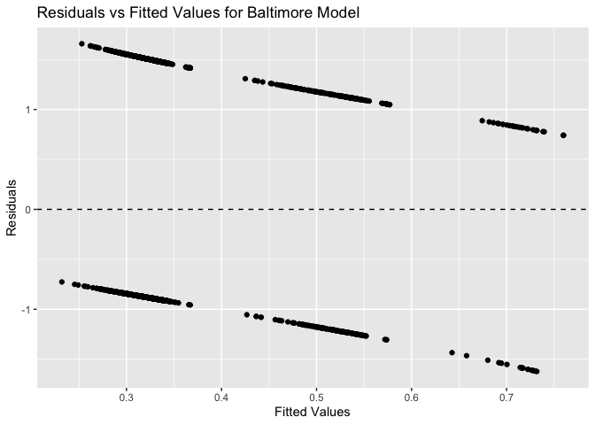

P8105 Homework 6
================
Vaiju Raja (vr2576)
2024-12-02

``` r
library(tidyverse)
```

    ## ── Attaching core tidyverse packages ──────────────────────── tidyverse 2.0.0 ──
    ## ✔ dplyr     1.1.4     ✔ readr     2.1.5
    ## ✔ forcats   1.0.0     ✔ stringr   1.5.1
    ## ✔ ggplot2   3.5.1     ✔ tibble    3.2.1
    ## ✔ lubridate 1.9.3     ✔ tidyr     1.3.1
    ## ✔ purrr     1.0.2     
    ## ── Conflicts ────────────────────────────────────────── tidyverse_conflicts() ──
    ## ✖ dplyr::filter() masks stats::filter()
    ## ✖ dplyr::lag()    masks stats::lag()
    ## ℹ Use the conflicted package (<http://conflicted.r-lib.org/>) to force all conflicts to become errors

``` r
library(rvest)
```

    ## 
    ## Attaching package: 'rvest'
    ## 
    ## The following object is masked from 'package:readr':
    ## 
    ##     guess_encoding

``` r
library(broom)
library(rnoaa)
```

    ## Registered S3 method overwritten by 'hoardr':
    ##   method           from
    ##   print.cache_info httr
    ## The rnoaa package will soon be retired and archived because the underlying APIs have changed dramatically. The package currently works but does not pull the most recent data in all cases. A noaaWeather package is planned as a replacement but the functions will not be interchangeable.

``` r
library(readr)
library(purrr)
```

## Problem 1: 2017 Central Park Weather Data

``` r
# Load data
weather_df = 
  rnoaa::meteo_pull_monitors(
    c("USW00094728"),
    var = c("PRCP", "TMIN", "TMAX"), 
    date_min = "2017-01-01",
    date_max = "2017-12-31") %>%
  mutate(
    name = recode(id, USW00094728 = "CentralPark_NY"),
    tmin = tmin / 10,
    tmax = tmax / 10) %>%
  select(name, id, everything())


# Bootstrap sampling
set.seed(123) 

bootstrap_results <- weather_df %>%
  modelr::bootstrap(n = 5000) %>% # Generate 5000 bootstrap samples
  mutate(models = map(strap, ~lm(tmax ~ tmin, data = .x)), # Fit linear models
    rsq = map_dbl(models, ~broom::glance(.x)$r.squared), # Extract R^2
    log_beta_product = map_dbl(
      models, 
      ~{
        coefs <- broom::tidy(.x)
        log(coefs$estimate[1] * coefs$estimate[2])
      }
    )
  )

glimpse(bootstrap_results)
```

    ## Rows: 5,000
    ## Columns: 5
    ## $ strap            <list> [<resample[365 x 6]>], [<resample[365 x 6]>], [<resa…
    ## $ .id              <chr> "0001", "0002", "0003", "0004", "0005", "0006", "0007…
    ## $ models           <list> [7.565933, 1.035726, 1.358875396, -4.290907859, -3.7…
    ## $ rsq              <dbl> 0.9091651, 0.9045637, 0.9247719, 0.9081875, 0.9182915…
    ## $ log_beta_product <dbl> 2.058758, 2.022636, 1.991633, 2.042806, 2.066621, 2.0…

``` r
# Visualize the distributions
bootstrap_results %>%
  select(rsq, log_beta_product) %>%
  pivot_longer(cols = everything(), names_to = "metric", values_to = "value") %>%
  ggplot(aes(x = value, fill = metric)) +
  geom_histogram(bins = 30, alpha = 0.7, position = "identity") +
  facet_wrap(~metric, scales = "free", labeller = as_labeller(
    c(rsq = "R-squared", log_beta_product = "Log(Beta_0 * Beta_1)")
  )) +
  theme_minimal() +
  labs(title = "Bootstrap Distributions",
    x = "Value",
    y = "Frequency",
    fill = "Metric")
```

<!-- -->

``` r
# Calculate summary statistics
ci_results <- bootstrap_results %>%
  summarize(rsq_ci = quantile(rsq, probs = c(0.025, 0.975)),
    log_beta_ci = quantile(log_beta_product, probs = c(0.025, 0.975))
  )
```

    ## Warning: Returning more (or less) than 1 row per `summarise()` group was deprecated in
    ## dplyr 1.1.0.
    ## ℹ Please use `reframe()` instead.
    ## ℹ When switching from `summarise()` to `reframe()`, remember that `reframe()`
    ##   always returns an ungrouped data frame and adjust accordingly.
    ## Call `lifecycle::last_lifecycle_warnings()` to see where this warning was
    ## generated.

## Problem 2: Homicide Data Analysis

``` r
# Load and clean data
homicides_data = read_csv("data/homicide-data.csv") %>%
  filter(victim_race %in% c("White", "Black")) %>%
  mutate(victim_sex = factor(victim_sex, levels = c("Male", "Female")),  
        victim_sex = fct_drop(victim_sex),  # Drop the "Unknown" level
        victim_race = factor(victim_race, levels = c("White", "Black")),
    city_state = str_c(city, state, sep = ", "),
    resolved = if_else(disposition == "Closed by arrest", 1, 0),
    victim_age = as.numeric(victim_age)) %>%
  filter(!city_state %in% c("Dallas, TX", "Phoenix, AZ", "Kansas City, MO", "Tulsa, AL")) 
```

    ## Warning: There was 1 warning in `mutate()`.
    ## ℹ In argument: `victim_age = as.numeric(victim_age)`.
    ## Caused by warning:
    ## ! NAs introduced by coercion

``` r
head(homicides_data)
```

    ## # A tibble: 6 × 14
    ##   uid   reported_date victim_last victim_first victim_race victim_age victim_sex
    ##   <chr>         <dbl> <chr>       <chr>        <fct>            <dbl> <fct>     
    ## 1 Alb-…      20100601 SATTERFIELD VIVIANA      White               15 Female    
    ## 2 Alb-…      20100102 MULA        VIVIAN       White               72 Female    
    ## 3 Alb-…      20100126 BOOK        GERALDINE    White               91 Female    
    ## 4 Alb-…      20100130 MARTIN-LEY… GUSTAVO      White               56 Male      
    ## 5 Alb-…      20100218 LUJAN       KEVIN        White               NA Male      
    ## 6 Alb-…      20100308 GRAY        STEFANIA     White               43 Female    
    ## # ℹ 7 more variables: city <chr>, state <chr>, lat <dbl>, lon <dbl>,
    ## #   disposition <chr>, city_state <chr>, resolved <dbl>

``` r
## Baltimore data subset
baltimore_data = homicides_data %>%
  filter(city_state == "Baltimore, MD")

# Fit logistic regression model
baltimore_glm = glm(resolved ~ victim_age + victim_sex + victim_race, 
                    family = binomial(), 
                    data = baltimore_data)
baltimore_results = broom::tidy(baltimore_glm, exponentiate = TRUE, conf.int = TRUE)
baltimore_results
```

    ## # A tibble: 4 × 7
    ##   term             estimate std.error statistic  p.value conf.low conf.high
    ##   <chr>               <dbl>     <dbl>     <dbl>    <dbl>    <dbl>     <dbl>
    ## 1 (Intercept)         1.35    0.212        1.40 1.61e- 1    0.890     2.05 
    ## 2 victim_age          0.993   0.00332     -2.02 4.30e- 2    0.987     1.00 
    ## 3 victim_sexFemale    2.35    0.138        6.18 6.26e-10    1.79      3.08 
    ## 4 victim_raceBlack    0.431   0.175       -4.82 1.45e- 6    0.305     0.606

``` r
# Estimate and confidence interval for adjusted odds ratio for male vs. female
odds_ratio_baltimore = exp(baltimore_results %>% 
                           filter(term == "victim_sexFemale") %>% 
                           select(estimate, conf.low, conf.high))
odds_ratio_baltimore
```

    ## # A tibble: 1 × 3
    ##   estimate conf.low conf.high
    ##      <dbl>    <dbl>     <dbl>
    ## 1     10.5     6.01      21.9

``` r
## All cities
# Run logistic regression for each city and extract OR for sex
city_results = homicides_data %>%
  group_by(city_state) %>%
  nest() %>%
  mutate(glm_model = map(data, ~ glm(resolved ~ victim_age + victim_sex + victim_race, 
                                     data = ., 
                                     family = binomial)),
         or_results = map(glm_model, ~ tidy(., exponentiate = TRUE, conf.int = TRUE) %>%
                           filter(str_detect(term, "victim_sexFemale")))) %>%
  unnest(or_results)
head(city_results)
```

    ## # A tibble: 6 × 10
    ## # Groups:   city_state [6]
    ##   city_state      data     glm_model term  estimate std.error statistic  p.value
    ##   <chr>           <list>   <list>    <chr>    <dbl>     <dbl>     <dbl>    <dbl>
    ## 1 Albuquerque, NM <tibble> <glm>     vict…    0.566     0.385 -1.48     1.39e- 1
    ## 2 Atlanta, GA     <tibble> <glm>     vict…    1.00      0.194 -0.000397 1.00e+ 0
    ## 3 Baltimore, MD   <tibble> <glm>     vict…    2.35      0.138  6.18     6.26e-10
    ## 4 Baton Rouge, LA <tibble> <glm>     vict…    2.62      0.306  3.15     1.65e- 3
    ## 5 Birmingham, AL  <tibble> <glm>     vict…    1.15      0.212  0.657    5.11e- 1
    ## 6 Boston, MA      <tibble> <glm>     vict…    1.50      0.324  1.25     2.12e- 1
    ## # ℹ 2 more variables: conf.low <dbl>, conf.high <dbl>

``` r
# Plot the ORs with CIs for each city
city_results %>%
  ggplot(aes(x = city_state, y = estimate, ymin = conf.low, ymax = conf.high)) +
  geom_pointrange(position = position_dodge(width = 0.7)) +
  coord_flip() +  
  labs(title = "Adjusted Odds Ratios for Male vs Female in Resolved Homicides",
    x = "City",
    y = "Odds Ratio (Female vs Male)") +
  theme_minimal() +
  theme(axis.text.y = element_text(size = 8))
```

<!-- -->

**Baltimore:** Female victims are 10.5 times more likely to have their
homicides resolved than male victims. The confidence interval (6.01,
21.9) suggests that this result is statistically significant and points
to a substantial gender disparity in homicide resolution rates.

**Adjusted Odds Ratios for Male vs Female in Resolved Homicides:** Long
Beach, CA, and New York, NY have the largest confidence intervals for
the adjusted odds of resolved homicides by sex. This greater uncertainty
in the estimate for these cities could be potentially due to higher data
variability.

Indianapolis, IN, and Houston, TX are shown to have the smallest
confidence intervals, suggesting that the estimates for these cities are
more precise with less variability in the data.

Among the cities analyzed, New York, NY has the highest adjusted odds
ratio (3.81) for resolved homicides by sex, meaning that women in New
York City have a significantly higher likelihood of their homicides
being solved compared to men. The confidence interval (2.06, 7.53) for
New York also suggests that this result is statistically significant.

In contrast, Albuquerque, NM has the lowest adjusted odds ratio (0.566),
indicating that women in this city are much less likely to have their
homicides solved compared to men.
